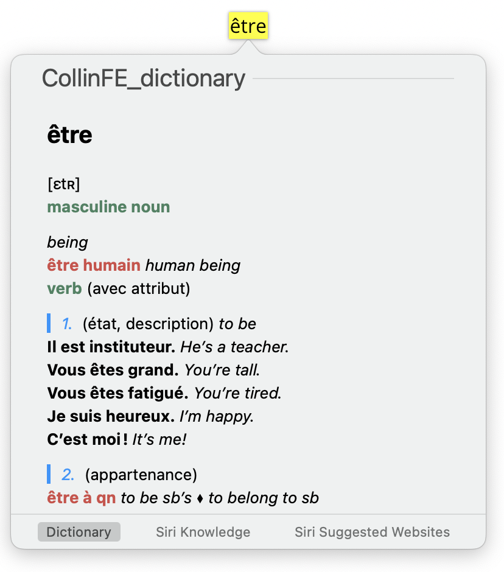

# French-English Collins Dictionary  for MacOS

This is used for Dictionary.app on MacOS (Also works with shorcuts to open anywhere).

### Example

|  |  |  |
| --------------------------------------------------- | --------------------------------------------------- | --------------------------------------------------- |

